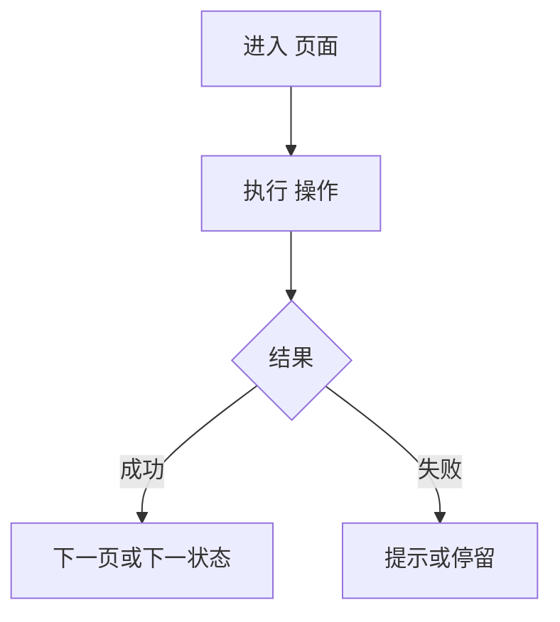

# 分析文档模板

写文档前按本文件的章节顺序落盘到 `docs/analysis/{产品或模块}-analysis.md`。没有内容的小节写「本次范围未覆盖」并说明原因，不要删节。

截图路径相对于文档：`imgs/{序号}-{页面}-{状态}.png`。

将下面花括号占位替换为实际内容。Mermaid 图保留语言标记 `mermaid`。

---

# {产品或模块} 原型分析

## 分析范围

- 入口：{URL}
- 需求：{用户要分析的任务}
- 覆盖页面：{页面名称列表}

## 页面分析

### {页面名称}

#### 页面功能说明

这页完成什么任务。用户能做哪些事。页面各区域分别承担什么（导航、浏览、填写、决策、反馈）。

#### 界面信息项

按截图逐条抄录，不要合并成「等字段」。没在本页出现的不写。

| 界面原文 | 出现位置 | 可见约束 |
| --- | --- | --- |
| {标签/列名/状态文案/占位符} | {表单 / 列表列 / 筛选 / 详情区…} | {必填标记 / 禁用 / 提示原文 / 无} |

#### 操作项

| 操作原文 | 所在区域 | 点了之后（界面上发生的事） |
| --- | --- | --- |
| {按钮/链接/Tab/筛选…} | {页头 / 主区 / 行内…} | {跳转 / 展开 / 提示文案 / 无变化} |

#### 交互行为与状态变化

| 用户操作 | 界面变化 |
| --- | --- |
| {点击/输入/选择…} | {出现提示 / 跳转 / 按钮可用…} |

空状态、错误、成功、展开态若有截图，紧跟在对应说明后插入。选项型控件把实际看到的选项原文列出。

## 用户操作流程图

主路径用一张图。分支多时按场景拆图，图题写清场景名。

## 业务流程分析

只根据实际走到的路径写：谁、在什么条件下、经过哪些页面、界面上出现什么结果。页面交接只写看见的跳转与带回的文案。未走到的路径列入「未从原型确认」，不要按惯例补全。

需要时再补一张业务流程图：

## 开发分析依据

只列后续方案设计可引用的观察事实。不写数据结构、接口字段、ER、技术选型或实现建议。

### 业务场景

- {场景名}：触发条件、涉及页面、成功与失败在界面上分别是什么

### 功能清单

- {功能}：所在页面、用户怎么用、完成后看到什么

### 信息项汇总

按页面罗列界面原文，供后续 plan 引用。不改名、不加类型、不合并为实体。

- {页面}：{原文1}、{原文2}、…

### 状态与规则

- {规则}：界面原文或操作结果 + 对应截图/步骤。写不出证据的不写

### 页面关联

- {页面 A} → {页面 B}：因什么操作发生，界面上带回什么信息或状态文案

### 未从原型确认

- {项}：界面未展示或本次未走到。后续 plan 将其标为待定，不得在本分析里补全或定稿
